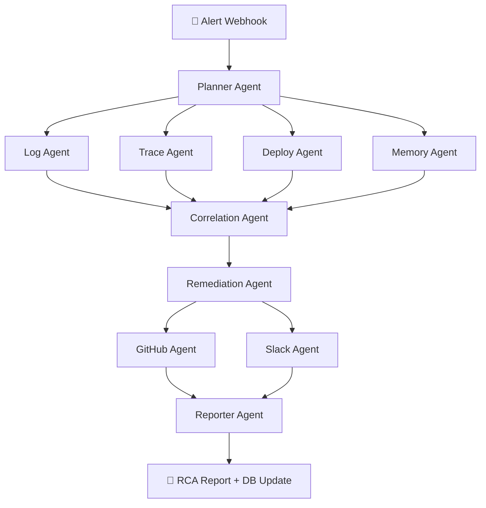

# SentinelOps AI — Platform Documentation

> **Autonomous Incident Triage & Root-Cause Analysis powered by Multi-Agent LLM Orchestration**

---

## 1. What Is SentinelOps AI?

SentinelOps AI is a **real-time autonomous incident investigation platform** that replaces the manual on-call triage process with a coordinated team of AI agents. When an alert fires (e.g., a P99 latency spike from Datadog), the system automatically:

1. **Classifies** the incident type and priority
2. **Investigates** in parallel — scanning logs, traces, deployments, and historical incidents simultaneously
3. **Correlates** all evidence into a causal chain with a confidence score
4. **Recommends** a ranked remediation action (rollback, restart, scale-out)
5. **Reports** — generating a full RCA Markdown report, a Slack alert, and a GitHub tracking issue

The entire pipeline runs in **under 15 seconds** and streams every step live to a dark-mode dashboard via WebSocket.

---

## 2. Architecture Overview



### Technology Stack

| Layer | Technology |
|---|---|
| **Orchestration** | LangGraph (StateGraph with parallel fan-out) |
| **LLM Providers** | Gemini 1.5 Flash → Groq Llama 3.3 → GPT-4o-mini (cascading fallback) |
| **Backend API** | FastAPI + Uvicorn |
| **Database** | SQLAlchemy 2.0 (typed ORM) + SQLite |
| **Frontend** | Next.js 14 + Zustand + Framer Motion |
| **Real-time** | WebSocket (per-incident live stream) |
| **Observability** | Omium tracing (optional execution replay) |
| **Testing** | Pytest (20 tests) |

---

## 3. The Agent Pipeline — Step by Step

### 3.1 Planner Agent
**Role:** Incident classifier and execution planner.

- Receives the raw alert webhook payload (`service`, `severity`, `incident_type`, `message`)
- Classifies into categories: `latency_spike`, `deploy_regression`, `oom_crash`, `config_drift`, `dependency_failure`
- Assigns priority: `critical` / `high` / `medium` / `low`
- Generates an ordered execution plan and creates `InvestigationTask` objects for UI tracking
- **LLM-enhanced:** When an API key is available, uses structured output parsing to produce richer classification; falls back to keyword-based rules otherwise

### 3.2 Parallel Specialist Agents (Fan-Out)

After the planner completes, **four agents execute simultaneously**:

#### Log Agent
- Queries the database for recent logs matching the affected service
- Performs rule-based pattern detection: counts errors, extracts top error messages, identifies timeout patterns
- Optionally calls the LLM via `specialist_llm.analyze_logs()` for deeper narrative analysis
- **Output:** `logs_summary`, `raw_logs`

#### Trace Agent
- Fetches distributed trace spans for the service
- Identifies the slowest span (bottleneck), reconstructs the dependency chain (e.g., `api-gateway → checkout-api → database-cluster`)
- Includes **checkpoint events** for Omium replay (retry simulation)
- **Output:** `trace_summary`, `trace_spans`, `checkpoint_events`

#### Deploy Agent
- Retrieves recent deployments, identifies the latest version and its timing relative to the incident
- Detects regression candidates by comparing the suspect deploy (`v2.14.0`) against the known stable baseline (`v2.13.9`, annotated with `stable_baseline: true`)
- **Output:** `deployment_summary`, `recent_deployments`, `rollback_target`

#### Memory Agent
- Queries `RemediationHistory` for past incidents with similar patterns
- Surfaces successful remediations (e.g., "rollback resolved a similar pool exhaustion 3 days ago")
- **Output:** `historical_matches`, `memory_context`

### 3.3 Correlation Agent
**Role:** The "brain" — synthesises all specialist evidence into a unified root-cause hypothesis.

- Receives: `logs_summary`, `deployment_summary`, `trace_summary`, `memory_context`
- **LLM path:** Constructs a structured prompt with all evidence, asks for `{probable_root_cause, causal_chain, confidence_score}` as JSON
- **Rule-based fallback:** Keyword matching across deployment/pool/latency/OOM signals, each contributing to a cumulative confidence score
- **Output:** `probable_root_cause`, `causal_chain`, `confidence_score` (0.0–1.0)

### 3.4 Remediation Agent
**Role:** Generates ranked remediation candidates and selects the best action.

- Analyses the causal chain and deployment context to build candidates:
  - **Rollback** (low risk, high confidence when deploy regression detected)
  - **Restart / pool reset** (medium risk, for connection exhaustion)
  - **Scale-out** (medium risk, for capacity issues)
  - **Manual investigation** (always present as fallback)
- Selects the highest-confidence candidate and generates step-by-step execution instructions
- Writes a `RemediationHistory` row to the database for future memory lookups
- **Output:** `remediation_candidates`, `remediation_action`, `remediation_steps`

### 3.5 GitHub Agent
- Formats a GitHub issue with: incident ID, service, root cause, confidence, causal chain, and recommended action
- Calls the GitHub API (or dry-runs if `GITHUB_TOKEN` is not set)
- **Output:** `github_issue_payload`

### 3.6 Slack Agent
- Builds a rich `mrkdwn` message with severity emoji (🚨 for critical, ⚠️ otherwise), service name, root cause, action, and confidence
- Posts to the configured webhook (or dry-runs if `SLACK_WEBHOOK_URL` is not set)
- **Output:** `slack_message`, `report_sent`

### 3.7 Reporter Agent
- Generates a full Markdown RCA report with sections: Summary, Causal Chain, Evidence, Remediation, Timeline
- **LLM-enhanced:** When available, the LLM produces a polished executive summary; otherwise uses a structured template
- Writes final results back to the `Incident` database row: `summary`, `root_cause`, `causal_chain`, `confidence_score`, `remediation_action`, `status='resolved'`
- **Output:** `report_markdown`

---

## 4. Simulation Data — The Demo Incident Story

The `/simulate` endpoint seeds a realistic, causally-linked incident narrative:

### Log Timeline (5 events, staggered)

| Time | Level | Event |
|---|---|---|
| T-6m | `INFO` | App started with `db_pool_size=10` (was 500) — deploy `v2.14.0` `[REGRESSION]` |
| T-3m | `WARN` | HikariPool-1 utilization at 98% (9/10 connections active) |
| T-2m | `ERROR` | Connection not available — request timed out after 30,006ms |
| T-90s | `ERROR` | Pool timeout — 10/10 connections in use |
| T-60s | `ERROR` | Downstream checkout transaction timeout cascade |

### Deployment History (2 entries)

| Version | Deployed | Role |
|---|---|---|
| `v2.13.9` | 2 days ago | Known stable baseline (rollback target) |
| `v2.14.0` | 6 min ago | Suspect regression (reduced pool config) |

This gives the AI agents clear signal to follow the causal chain: **deploy → pool shrink → exhaustion → cascade → P99 spike**.

---

## 5. How the User Interacts

### 5.1 The Dashboard (Frontend)

The Next.js frontend presents **five tabs** via a sidebar:

| Tab | Purpose |
|---|---|
| **Command Center** | Main dashboard — trigger simulations, see active incidents, watch agent workflow progress live, download RCA reports |
| **Incidents** | Detailed incident view with all metadata |
| **Orchestration** | Visual DAG topology showing all 10 agent nodes with live status (pending → running → completed), edge animations, task queue, and live event stream |
| **Agents** | Per-agent detail panels |
| **Artifacts** | Generated reports, causal chains, remediation plans |

### 5.2 User Flow

```
┌─────────────────────────────────────────────────────────┐
│  1. User clicks "Simulate Incident" on Command Center   │
│     └─→ POST /simulate                                  │
│         └─→ Creates Incident row (status: investigating) │
│         └─→ Seeds demo logs + deployments                │
│         └─→ Returns incident_id + WebSocket URL          │
│                                                          │
│  2. Frontend opens WebSocket: /ws/incident/{id}          │
│     └─→ Backend streams agent-by-agent progress          │
│     └─→ Each message updates:                            │
│         • Agent step status (spinning → checkmark)       │
│         • Activity log (timestamped event stream)        │
│         • Trace spans (dependency graph)                 │
│         • Incident timeline (causal reconstruction)      │
│         • Confidence score (0–100%)                      │
│                                                          │
│  3. Investigation completes (~10-15 seconds)             │
│     └─→ Causal chain displayed in green banner           │
│     └─→ "View Artifacts" and "Download RCA" buttons      │
│     └─→ Slack alert dispatched to on-call channel        │
│     └─→ GitHub issue created for tracking                │
└─────────────────────────────────────────────────────────┘
```

### 5.3 Production Webhook Integration

For real production use, external monitoring tools (Datadog, PagerDuty, Grafana) send alerts to:

```
POST /webhook/alert
Content-Type: application/json

{
  "service": "billing-service",
  "severity": "critical",
  "incident_type": "latency_spike",
  "message": "P99 latency > 2.4s for 5 minutes"
}
```

The response includes the `incident_id` for tracking. The investigation runs as a background task, and results are available via:
- `GET /incident/{id}` — full incident + remediation history
- `GET /report/{id}` — RCA report (returns "in progress" until resolved)
- `GET /report/{id}/download` — downloadable Markdown file

---

## 6. State Management

### LangGraph State (Backend)

The `AgentState` TypedDict is the shared memory across all agents. Key design decisions:

- **`Annotated[List, add]` reducer** on `errors`, `activity`, `trace_spans`, `incident_timeline`, `checkpoint_events` — these accumulate across agents
- **`Annotated[Dict, ior]` reducer** on `agent_outputs` — merges per-agent output dicts
- **Plain fields** (`tasks`, `probable_root_cause`, etc.) — last-write-wins, only written by one agent at a time
- **Critical rule:** Parallel agents (log, deploy, trace, memory) must NOT write to non-annotated fields simultaneously — LangGraph rejects concurrent writes

### Zustand Store (Frontend)

The `useIncidentStore` manages all UI state:
- `agentSteps` — array of 10 agent nodes with status tracking
- `activityLog` — timestamped event stream
- `traceSpans` — distributed trace visualization data
- `incidentTimeline` — causal timeline for reconstruction
- `causalChain`, `remediation`, `rcaReport` — final outputs
- `omiumEnabled/omiumDashboardUrl` — Omium observability integration

---

## 7. LLM Provider Strategy

The system uses a **cascading fallback** pattern:

```
1. GOOGLE_API_KEY set?  → Gemini 1.5 Flash  (preferred: fast, cheap)
2. GROQ_API_KEY set?    → Llama 3.3 70B     (fallback: very fast inference)
3. OPENAI_API_KEY set?  → GPT-4o-mini       (fallback: widely available)
4. None set?            → Rule-based only    (no LLM, still fully functional)
```

Every agent works with **zero LLM keys configured** — rule-based fallbacks produce valid output for all phases. LLM enhancement improves the quality of summaries and correlation reasoning but is never a hard dependency.

---

## 8. Database Schema

SQLAlchemy 2.0 typed ORM (`Mapped` + `mapped_column`):

| Table | Key Columns |
|---|---|
| `incidents` | `id`, `title`, `severity`, `status`, `summary`, `root_cause`, `causal_chain`, `confidence_score`, `remediation_action`, `agent_outputs_json` |
| `deployments` | `id`, `service`, `version`, `timestamp`, `commit_hash` |
| `logs` | `id`, `service`, `level`, `message`, `timestamp` |
| `remediation_history` | `id`, `incident_id`, `action`, `outcome`, `confidence` |

**Terminal state invariant:** Once `status = 'failed'`, `update_incident_status()` is a no-op — no late-arriving agent can overwrite it.

---

## 9. Notification Formatters

### Slack (`format_incident_message`)
Pure function (no network I/O) → returns `mrkdwn` string:
```
🚨 *SentinelOps Alert — checkout-api*
> *Root Cause:* DB pool regression in v2.14.0
> *Action:* Rollback to v2.13.9 (87% confidence)
```

### GitHub (`format_github_issue`)
Pure function → returns `{title, body, labels}` dict with full Markdown: causal chain fence block, evidence table, severity-mapped labels (`["incident", "critical", "auto-triage"]`), next-steps checklist.

---

## 10. Testing

**20 tests across 6 groups**, all passing:

| Group | Tests | What It Validates |
|---|---|---|
| `TestHealthCheck` | 2 | Liveness probe returns `{status: ok}` |
| `TestSimulateFlow` | 4 | `/simulate` returns 200, `accepted` status, valid `incident_id`, WebSocket URL |
| `TestIncidentEndpoint` | 5 | `/incident/{id}` returns correct fields, valid severity, valid status transitions, 404 for unknown IDs |
| `TestReportEndpoint` | 3 | `/report/{id}` lifecycle: in-progress → ready, 404 for unknown |
| `TestSlackFormatter` | 3 | Pure function output: contains service name, confidence, returns string |
| `TestGitHubFormatter` | 3 | Pure function output: returns dict, has labels list, body is Markdown |

---

## 11. Environment Setup

### Required
```bash
python3 -m venv .venv
source .venv/bin/activate
pip install -r backend/requirements.txt
```

### Environment Variables
```bash
# LLM (at least one; optional — rule-based fallback works without any)
GOOGLE_API_KEY=...
GROQ_API_KEY=...
OPENAI_API_KEY=...

# Notifications (optional — dry-run mode if unset)
SLACK_WEBHOOK_URL=https://hooks.slack.com/services/...
GITHUB_TOKEN=ghp_...
GITHUB_REPO=owner/repo
```

### Running
```bash
# Backend
cd backend && uvicorn main:app --reload --port 8000

# Frontend
cd frontend && npm run dev

# Tests
python -m pytest backend/test_api.py -v
```

---

## 12. API Reference

| Method | Endpoint | Description |
|---|---|---|
| `GET` | `/health` | Liveness probe |
| `POST` | `/simulate` | Trigger demo incident investigation |
| `POST` | `/webhook/alert` | Production alert ingestion |
| `GET` | `/incident/{id}` | Incident details + remediation history |
| `GET` | `/report/{id}` | RCA report (or "in progress") |
| `GET` | `/report/{id}/download` | Download RCA as Markdown file |
| `WS` | `/ws/incident/{id}` | Live investigation stream |
| `GET` | `/omium/status` | Omium tracing status |

---

## 13. Design Principles

1. **Pure logic, separate side-effects.** Formatters are pure functions; network I/O lives in dedicated agent nodes. This enables unit testing without mocking.

2. **Rule-based floor, LLM ceiling.** Every agent produces valid output with zero LLM keys. LLMs enhance but never gate.

3. **Failed is terminal.** Database state integrity: once an incident fails, no stale agent heartbeat can resurrect it.

4. **Parallel safety.** Only `add`-annotated fields are written by concurrent agents. Non-annotated fields are written by exactly one agent per step.

5. **Runtime is authoritative.** `pytest` is ground truth. IDE type-checker errors are advisory. Never refactor passing code because a language server panicked.
