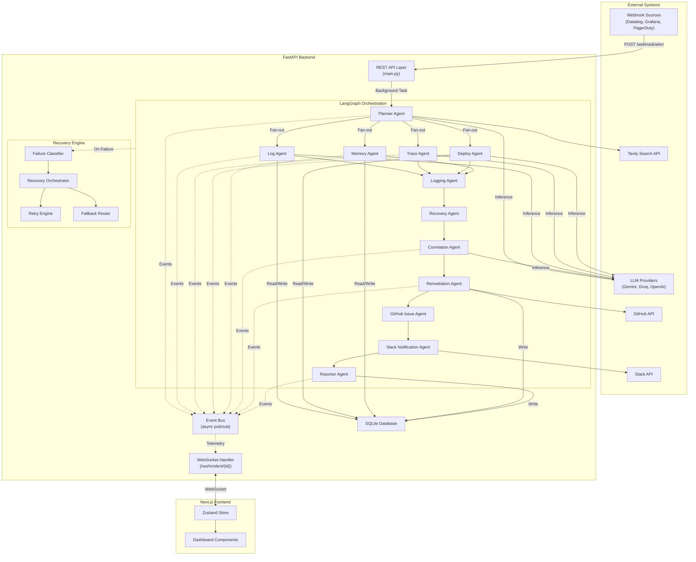
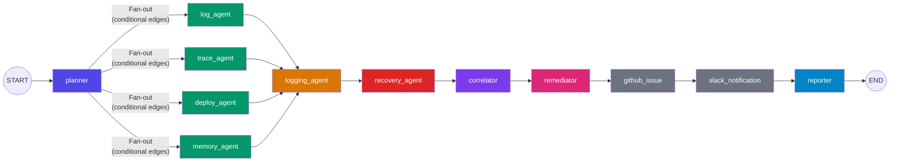
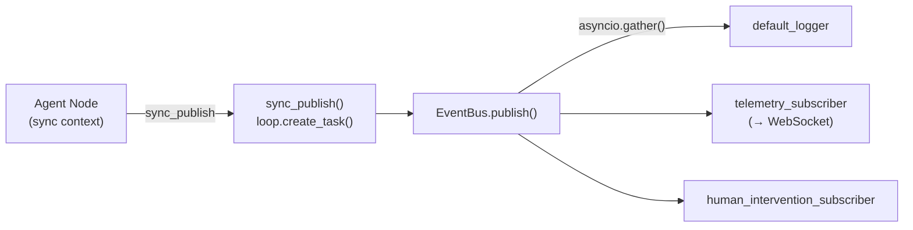
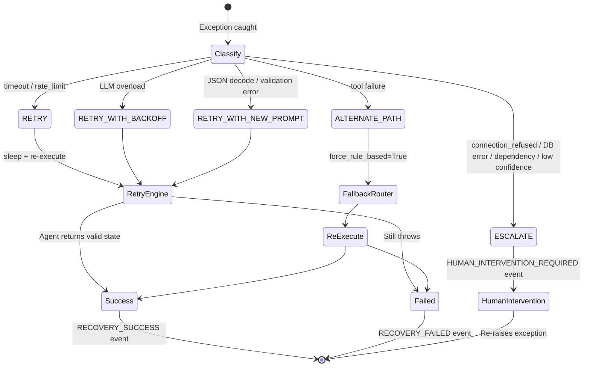
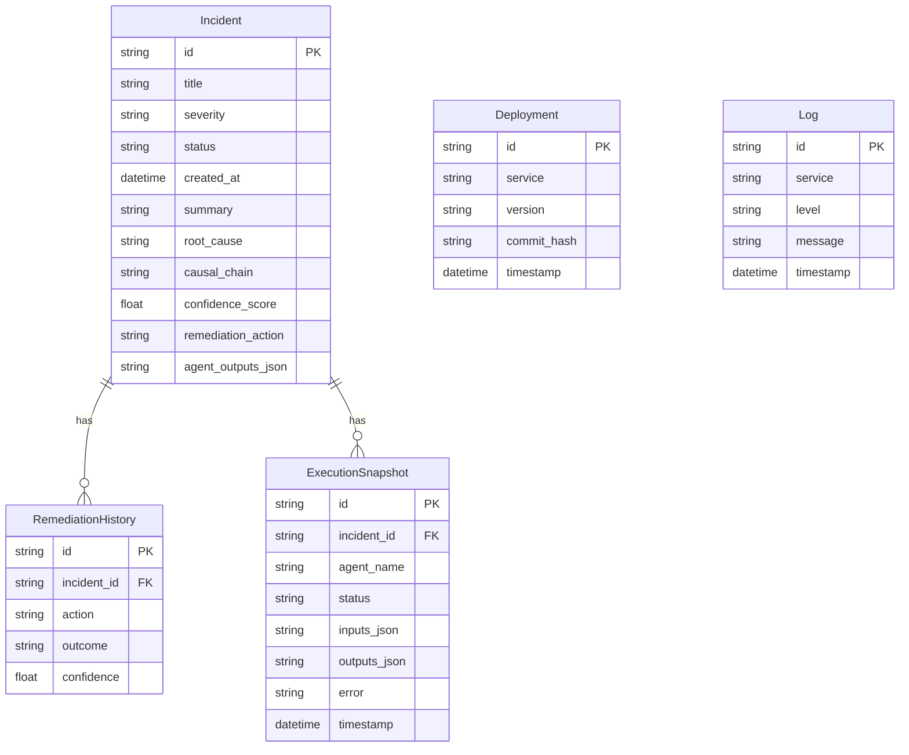
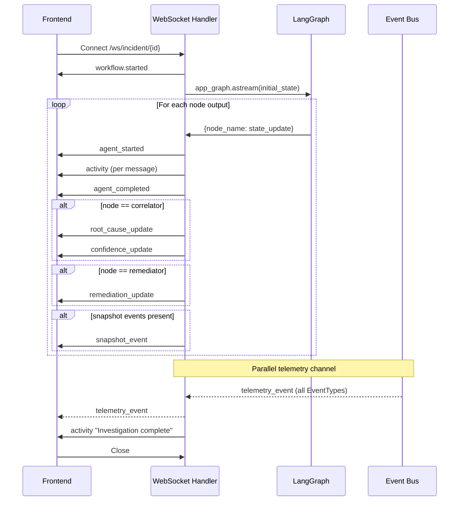
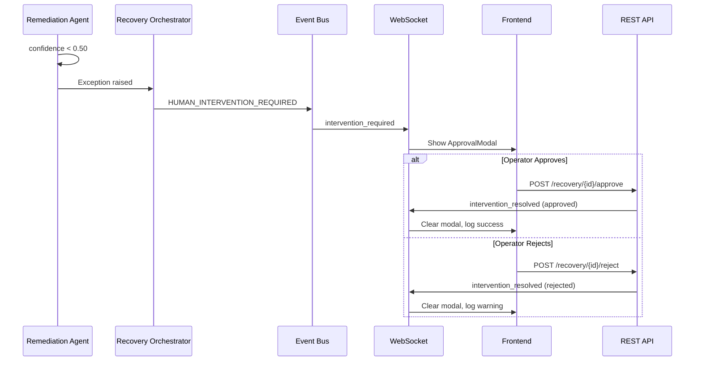
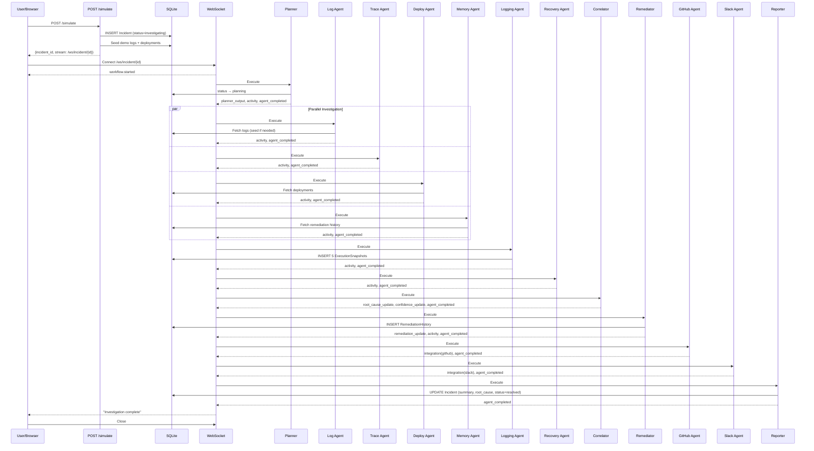
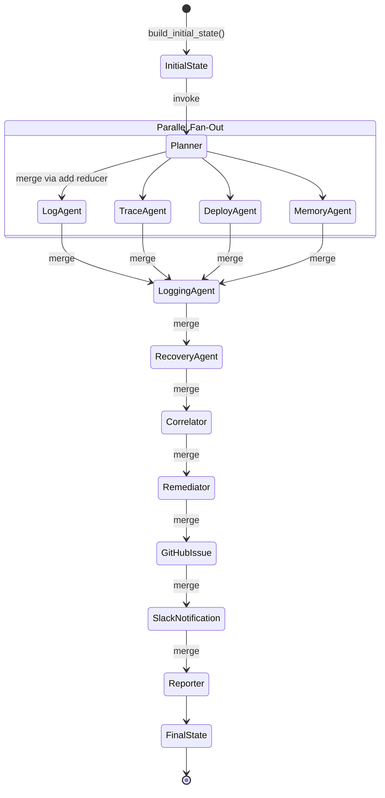
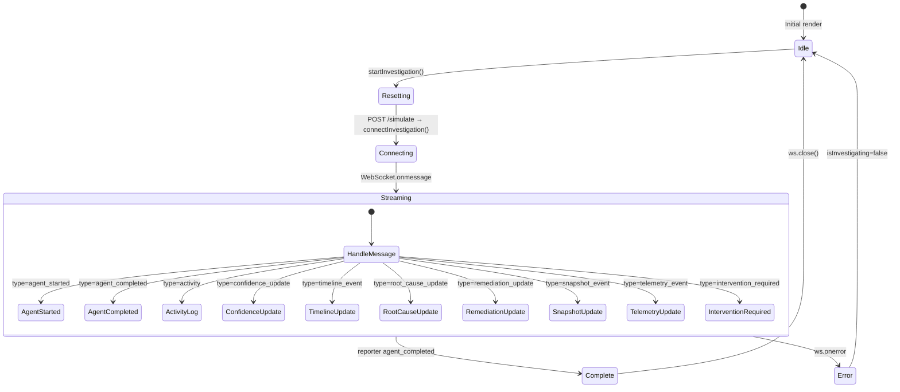

# SentinelOps AI — System Architecture Documentation

> **Document Classification**: Internal Engineering Reference  
> **Version**: 1.0 · May 2026  
> **Audience**: Senior Engineers, Platform Architects, SRE Teams

---

## 1. Executive Summary

SentinelOps AI is an **autonomous incident orchestration platform** that ingests production alerts, dispatches a swarm of LLM-powered investigation agents in parallel via LangGraph, synthesizes root-cause analyses, generates remediation plans, and—when confidence is high enough—executes those plans without human intervention.

**Core capabilities:**
- Multi-agent parallel investigation (Log, Trace, Deploy, Memory)
- LLM-first with deterministic rule-based fallback (Gemini → Groq → OpenAI → rules)
- Autonomous failure classification and self-healing recovery
- Human-in-the-loop approval for low-confidence actions
- Real-time WebSocket telemetry streaming to a Next.js dashboard
- Full execution snapshot persistence for audit replay

---

## 2. Repository Structure

```
SentinelOps AI/
├── backend/
│   ├── main.py                    # FastAPI app, routes, WebSocket handler
│   ├── database.py                # SQLAlchemy engine + SessionLocal factory
│   ├── models.py                  # ORM: Incident, Deployment, Log, RemediationHistory, ExecutionSnapshot
│   ├── omium_tracing.py           # Optional Omium SDK integration for trace observability
│   ├── agents/
│   │   ├── state.py               # AgentState TypedDict (LangGraph shared state)
│   │   ├── graph.py               # LangGraph DAG: node registration, edges, snapshot_wrapper
│   │   ├── planner_agent.py       # Alert classification + execution plan generation
│   │   ├── log_agent.py           # Service log analysis
│   │   ├── trace_agent.py         # Distributed trace analysis + checkpoint demo
│   │   ├── deploy_agent.py        # Deployment regression detection
│   │   ├── memory_agent.py        # Historical incident retrieval
│   │   ├── correlation_agent.py   # Multi-signal root-cause synthesis
│   │   ├── remediation_agent.py   # Ranked remediation candidate selection
│   │   ├── reporter_agent.py      # Final RCA Markdown report generation
│   │   ├── github_agent.py        # GitHub issue creation side-effect
│   │   ├── slack_agent.py         # Slack notification side-effect
│   │   ├── observer_agents.py     # Logging Agent (snapshots) + Recovery Agent (self-heal)
│   │   ├── specialist_llm.py      # Domain-specific LLM analysis (logs, traces, deploys)
│   │   ├── llm_utils.py           # Shared LLM factory (Gemini/Groq/OpenAI)
│   │   ├── tasks.py               # InvestigationTask Pydantic models
│   │   ├── timeline.py            # Timeline event helpers
│   │   └── db_utils.py            # update_incident_status with terminal-state guard
│   ├── core/
│   │   ├── events/
│   │   │   ├── event_types.py     # EventType + EventSeverity enums
│   │   │   ├── event_models.py    # Event Pydantic model
│   │   │   ├── event_bus.py       # Async EventBus singleton + sync_publish bridge
│   │   │   ├── event_subscribers.py # Default logger subscriber
│   │   │   └── __init__.py        # Public API re-exports
│   │   └── recovery/
│   │       ├── recovery_types.py  # FailureCategory + SeverityLevel enums
│   │       ├── failure_models.py  # FailureClassification + RecoveryRecommendation
│   │       ├── failure_classifier.py # Deterministic rule-based classifier
│   │       ├── recovery_orchestrator.py # Recovery decision tree + execution
│   │       ├── retry_engine.py    # Exponential backoff retry executor
│   │       └── fallback_router.py # LLM provider fallback + degraded mode
│   └── tools/
│       ├── log_tools.py           # Log seeding + DB fetch
│       ├── deployment_tools.py    # Deployment seeding + DB fetch
│       ├── trace_tools.py         # Mock distributed trace spans
│       ├── memory_tools.py        # Remediation history retrieval
│       ├── github_tools.py        # GitHub issue creation (live or dry-run)
│       ├── slack_tools.py         # Slack webhook (live or dry-run)
│       └── web_search_tools.py    # Tavily web search (live or mock)
├── frontend/
│   ├── src/
│   │   ├── app/
│   │   │   ├── page.tsx           # Root page with tab routing
│   │   │   ├── layout.tsx         # RootLayout (Inter font, dark mode)
│   │   │   └── globals.css        # Design tokens + CSS variables
│   │   ├── store/
│   │   │   └── useIncidentStore.ts # Zustand global state + WS message handler
│   │   ├── lib/
│   │   │   ├── websocket-events.ts # TypeScript event discriminated unions + type guards
│   │   │   ├── design-tokens.ts   # (Legacy) design token constants
│   │   │   └── utils.ts           # cn() utility
│   │   └── components/
│   │       ├── dashboard/         # CommandCenter, IncidentReplayDashboard, ApprovalModal, DemoControls, RuntimeEventStream
│   │       ├── orchestration/     # OrchestrationView, OmiumTracePanel
│   │       ├── shared/            # Sidebar, LiveActivityStream, RuntimeMemoryPanel, WebhookIntegrationPanel
│   │       ├── agents/            # AgentsView
│   │       ├── artifacts/         # GeneratedArtifactsView
│   │       ├── incident/          # IncidentDetail
│   │       └── ui/                # shadcn/ui primitives
```

---

## 3. High-Level Architecture



---

## 4. LangGraph Orchestration DAG



**Execution Phases:**

| Phase | Nodes | Execution | Purpose |
|-------|-------|-----------|---------|
| 1 — Planning | `planner` | Sequential | Classify incident, build execution plan |
| 2 — Investigation | `log_agent`, `trace_agent`, `deploy_agent`, `memory_agent` | **Parallel** | Gather domain-specific evidence |
| 3 — Observation | `logging_agent` | Sequential (fan-in) | Persist execution snapshots |
| 4 — Self-Healing | `recovery_agent` | Sequential | Detect anomalies, trigger recovery |
| 5 — Synthesis | `correlator` | Sequential | Multi-signal root-cause analysis |
| 6 — Action | `remediator` | Sequential | Ranked remediation selection |
| 7 — Side-Effects | `github_issue`, `slack_notification` | Sequential | External notifications |
| 8 — Reporting | `reporter` | Sequential | Generate final RCA Markdown report |

---

## 5. AgentState — The Shared State Contract

[state.py](file:///Users/strix/Documents/SentinalOps%20AI/backend/agents/state.py) defines a `TypedDict` with `total=False`, meaning every field is optional. LangGraph merges partial dicts returned by each node using **annotated reducers**:

| Field | Reducer | Behavior |
|-------|---------|----------|
| `activity` | `Annotated[List[str], add]` | Append-only across all nodes |
| `trace_spans` | `Annotated[List[Dict], add]` | Append-only |
| `incident_timeline` | `Annotated[List[Dict], add]` | Append-only |
| `errors` | `Annotated[List[str], add]` | Append-only — pipeline never halts |
| `agent_outputs` | `Annotated[Dict, ior]` | Merge via `|=` (dict union) |
| `snapshots` | `Annotated[List[Dict], add]` | Append-only |
| `checkpoint_events` | `Annotated[List[Dict], add]` | Append-only |

**Critical Design Rule**: Agent nodes return **partial dicts**. They must never mutate the `state` argument directly — doing so bypasses reducers and causes state corruption in concurrent fan-out execution.

---

## 6. Backend Module Deep-Dives

### 6.1 `snapshot_wrapper` (graph.py)

Every agent node is wrapped with `snapshot_wrapper(name)` before registration in the DAG. This decorator:

1. **Publishes** `AGENT_STARTED` event to the EventBus
2. **Captures** input state (alert_payload, tasks, activity count)
3. **Executes** the agent function
4. **On success**: Publishes `AGENT_COMPLETED`, persists `ExecutionSnapshot` to DB, merges snapshot metadata
5. **On failure**: Invokes `RecoveryOrchestrator.attempt_recovery()`
   - If recovery succeeds → persists "recovered" snapshot, returns healed state
   - If recovery fails → publishes `AGENT_FAILED`, persists "failed" snapshot, returns safe partial dict with error

### 6.2 Event Bus (`core/events/`)



- **Thread-safety**: `asyncio.Lock` protects subscriber list mutations
- **Retry**: `_safe_execute()` retries handlers up to 3× with exponential backoff (0.5s base)
- **Sync bridge**: `sync_publish()` schedules onto the running event loop via `loop.create_task()`. Falls back to `asyncio.run()` if no loop exists.

### 6.3 Recovery Engine (`core/recovery/`)



**Failure Classifier** uses a keyword-match rule engine (15 patterns) against `str(exception).lower()`. Each match yields `(FailureCategory, confidence, SeverityLevel, action_type)`. If `retry_count >= 3`, any retry-class action is auto-escalated to `ESCALATE`.

### 6.4 Database Schema



**Terminal State Guard** ([db_utils.py](file:///Users/strix/Documents/SentinalOps%20AI/backend/agents/db_utils.py)): Once `Incident.status = 'failed'`, no subsequent `update_incident_status()` call can overwrite it. This prevents late-arriving agent updates from masking failures.

### 6.5 LLM Strategy

```
Priority: GOOGLE_API_KEY → GROQ_API_KEY → OPENAI_API_KEY → Rule-based fallback
```

| Provider | Model (Planner/Correlation) | Model (Specialists) |
|----------|---------------------------|---------------------|
| Google | `gemini-1.5-pro` | `gemini-1.5-flash` |
| Groq | `llama3-70b-8192` | `llama-3.3-70b-versatile` |
| OpenAI | `gpt-4-turbo-preview` | `gpt-4o-mini` |

Every LLM call is wrapped with `invoke_with_trace()` which injects Omium callback handlers when tracing is enabled. If **no API key** is set, agents silently fall back to deterministic rule-based logic — the system is fully functional without any LLM.

### 6.6 API Layer (main.py)

| Endpoint | Method | Purpose |
|----------|--------|---------|
| `/health` | GET | Liveness probe |
| `/simulate` | POST | Create demo incident + start background investigation |
| `/webhook/alert` | POST | Production alert ingestion |
| `/webhook/generic` | POST | Universal webhook receiver |
| `/incident/{id}` | GET | Fetch incident + remediation history |
| `/report/{id}` | GET | Fetch RCA report |
| `/report/{id}/download` | GET | Download report as Markdown |
| `/api/v1/recovery/pending` | GET | List pending human approvals |
| `/api/v1/recovery/{id}/approve` | POST | Approve recovery action |
| `/api/v1/recovery/{id}/reject` | POST | Reject recovery action |
| `/ws/incident/{id}` | WS | Live investigation stream |
| `/omium/status` | GET | Omium tracing status |

---

## 7. Agent Deep-Dives

### 7.1 Planner Agent

**Purpose**: Classify the incoming alert and produce an ordered execution plan.

**Flow**: 
1. Try LLM planning (`_plan_llm`) — structured output via `JsonOutputParser(PlannerOutput)`
2. Fall back to `_plan_rule_based` — keyword matching on alert message
3. Generate `InvestigationTask` objects for UI visibility
4. Call `search_incident_context()` for web context enrichment
5. Emit `TASK_STARTED` / `TASK_COMPLETED` events

**Output fields**: `incident_type`, `priority`, `plan`, `tasks`, `web_search_context`, `agent_outputs`

### 7.2 Investigation Agents (Parallel)

| Agent | Data Source | LLM Analysis | Failure Simulation |
|-------|-----------|-------------|-------------------|
| **Log Agent** | `log_tools.get_recent_logs()` → SQLite | `specialist_llm.analyze_logs()` | `simulate_failures` contains `"llm_failure"` → Rate limit 429 |
| **Trace Agent** | `trace_tools.fetch_trace_spans()` → Mock data | `specialist_llm.analyze_traces()` | `"trace_timeout"` → `TimeoutError` |
| **Deploy Agent** | `deployment_tools.get_recent_deployments()` → SQLite | `specialist_llm.analyze_deployments()` | `"dependency_failure"` → `ImportError` |
| **Memory Agent** | `memory_tools.get_recent_remediation_history()` → SQLite | None (retrieval only) | None |

All four execute in parallel via LangGraph conditional edges. Each returns a partial dict that LangGraph merges via annotated reducers.

### 7.3 Observer Agents

**Logging Agent**: Creates 5 `ExecutionSnapshot` rows (one per completed agent) for runtime audit. Acts as "Workflow Memory".

**Recovery Agent**: Scans accumulated `activity` strings for error/failure keywords. If found, emits recovery activity messages and a checkpoint event. This is a lightweight heuristic observer — heavy recovery is handled by `RecoveryOrchestrator` in `snapshot_wrapper`.

### 7.4 Correlation Agent

Synthesizes all evidence into a single root-cause hypothesis:
- **LLM path**: Structured prompt with all summaries → `JsonOutputParser(CorrelationOutput)`
- **Rule path**: Keyword scanning across logs/deploys/traces/memory → confidence accumulation
- Outputs: `probable_root_cause`, `causal_chain`, `confidence_score`

### 7.5 Remediation Agent

Builds ranked candidates via `_build_candidates()`:
1. **Rollback** (if deploy keyword detected) — confidence boosted by +0.10
2. **Restart/Pool Reset** (if pool/OOM keyword detected) — confidence 0.70
3. **Scale Out** (if latency keyword detected) — confidence 0.60
4. **Historical Boost** — if past rollback resolved similar incident, +0.05
5. **Fallback** — escalate to on-call engineer

If `best.confidence < 0.50` → sets `requires_approval = True` for human-in-the-loop.

### 7.6 Side-Effect Agents

**GitHub Issue Agent**: Formats issue body with incident metadata, posts via GitHub API (or dry-run).
**Slack Notification Agent**: Formats mrkdwn message, posts via webhook (or dry-run).
**Reporter Agent**: Generates full Markdown RCA report, persists to `Incident.summary`, updates status to `"resolved"`.

---

## 8. WebSocket Protocol



**Message Types**: `agent_started`, `agent_completed`, `activity`, `planner_output`, `confidence_update`, `root_cause_update`, `remediation_update`, `timeline_event`, `integration`, `snapshot_event`, `telemetry_event`, `intervention_required`, `intervention_resolved`

---

## 9. Frontend Architecture

### 9.1 State Management (Zustand)

[useIncidentStore.ts](file:///Users/strix/Documents/SentinalOps%20AI/frontend/src/store/useIncidentStore.ts) is the single source of truth. Key design decisions:

- **`handleWsMessage()`**: A pure function that pattern-matches on `event.type` using discriminated union type guards
- **`runtimeEvents`**: Capped at 100 entries via `slice(-99)` to prevent memory leaks
- **`startInvestigation()`**: Resets ALL state fields before initiating — prevents stale data bleeding
- **`resolveIntervention()`**: Optimistic UI update (clears `pendingIntervention` before API call)
- **Node mapping**: Backend names (e.g., `"log_agent"`) → UI step IDs (e.g., `"log"`)

### 9.2 Component Hierarchy

```
page.tsx
├── Sidebar (navigation)
├── AnimatePresence (page transitions)
│   ├── CommandCenter (default view — trigger investigation)
│   ├── IncidentReplayDashboard (active investigation view)
│   │   ├── LiveActivityStream
│   │   ├── RuntimeEventStream
│   │   └── RuntimeMemoryPanel
│   ├── OrchestrationView
│   │   └── OmiumTracePanel
│   ├── AgentsView
│   ├── IncidentDetail
│   └── GeneratedArtifactsView
└── ApprovalModal (global overlay for human-in-the-loop)
```

### 9.3 Human-in-the-Loop Flow



---

## 10. Failure Injection System

Controlled via `simulate_failures` query parameter (comma-separated):

| Toggle | Agent | Exception | Recovery Path |
|--------|-------|-----------|---------------|
| `trace_timeout` | Trace Agent | `TimeoutError` | RETRY via RetryEngine |
| `llm_failure` | Log Agent | `Exception("Rate limit 429")` | RETRY_WITH_BACKOFF |
| `dependency_failure` | Deploy Agent | `ImportError` | ESCALATE (dependency) |
| `malformed_output` | Correlation Agent | `ValueError("jsondecodeerror")` | RETRY_WITH_NEW_PROMPT |

Each agent checks `state.get("simulate_failures", "")` and only triggers on the **first attempt** (`retries == 0`). After recovery increments the retry counter, the second attempt succeeds normally.

# SentinelOps AI — Execution Flows & Engineering Analysis

> **Companion to**: `sentinelops_architecture_doc.md`  
> **Document Classification**: Internal Engineering Reference  
> **Version**: 1.0 · May 2026

---

## 11. End-to-End Execution Walkthroughs

### 11.1 Happy Path — Simulated Incident



### 11.2 Failure + Recovery Path

When `simulate_failures=trace_timeout` is set:

1. **Trace Agent** raises `TimeoutError("Deadline exceeded...")`
2. `snapshot_wrapper` catches → calls `RecoveryOrchestrator.attempt_recovery()`
3. **FailureClassifier** matches `"deadline exceeded"` → `(TIMEOUT, 0.9, HIGH, RETRY)`
4. Publishes `RECOVERY_TRIGGERED` event (forwarded to WebSocket as `telemetry_event`)
5. **RetryEngine** sleeps `retry_delay_sec`, re-executes `trace_agent(state)` with `trace_agent_retries=1`
6. Second attempt succeeds (simulated failure only fires on `retries == 0`)
7. Publishes `RECOVERY_SUCCESS` event
8. Persists `ExecutionSnapshot(status="recovered")`
9. Pipeline continues normally from trace agent output

### 11.3 Human Escalation Path

When `simulate_failures=dependency_failure`:

1. **Deploy Agent** raises `ImportError("ModuleNotFoundError...")`
2. **FailureClassifier** matches `"modulenotfound"` → `(DEPENDENCY_FAILURE, 0.9, CRITICAL, ESCALATE)`
3. **RecoveryOrchestrator** enters `ESCALATE` branch
4. Publishes `HUMAN_INTERVENTION_REQUIRED` event
5. `human_intervention_subscriber` stores approval data in `PENDING_APPROVALS` dict
6. Broadcasts `intervention_required` to WebSocket
7. Frontend shows `ApprovalModal` with reason, confidence, agent name
8. Operator clicks Approve → `POST /api/v1/recovery/{id}/approve`
9. Backend broadcasts `intervention_resolved` → modal closes

> [!IMPORTANT]
> After escalation, the exception is **re-raised**. The `snapshot_wrapper` catches it in the final `except` block and returns a safe partial dict with `errors`. The pipeline **continues** — it does not halt. Downstream agents (correlator, remediator) receive degraded input and produce best-effort results.

---

## 12. Event Propagation Model

### 12.1 Event Types & Emitters

| Event Type | Emitter | Subscriber(s) |
|-----------|---------|---------------|
| `TASK_STARTED` | Planner Agent | default_logger, telemetry_subscriber |
| `TASK_COMPLETED` | Planner Agent | default_logger, telemetry_subscriber |
| `AGENT_STARTED` | snapshot_wrapper (all agents) | default_logger, telemetry_subscriber |
| `AGENT_COMPLETED` | snapshot_wrapper (all agents) | default_logger, telemetry_subscriber |
| `AGENT_FAILED` | snapshot_wrapper (unrecoverable) | default_logger, telemetry_subscriber |
| `RECOVERY_TRIGGERED` | RecoveryOrchestrator | default_logger, telemetry_subscriber |
| `RECOVERY_SUCCESS` | RecoveryOrchestrator | default_logger, telemetry_subscriber |
| `RECOVERY_FAILED` | RecoveryOrchestrator | default_logger, telemetry_subscriber |
| `HUMAN_INTERVENTION_REQUIRED` | RecoveryOrchestrator | default_logger, telemetry_subscriber, human_intervention_subscriber |

### 12.2 Sync-to-Async Bridge

LangGraph agent nodes execute synchronously. The event bus is async. The bridge works via:

```python
def sync_publish(event: Event) -> None:
    try:
        loop = asyncio.get_running_loop()    # FastAPI's event loop
        loop.create_task(event_bus.publish(event))  # Fire-and-forget
    except RuntimeError:
        asyncio.run(event_bus.publish(event))  # Fallback for tests/scripts
```

This is **non-blocking** — agents do not wait for subscribers to complete. Events are scheduled as asyncio tasks on the FastAPI event loop.

---

## 13. State Management Deep-Dive

### 13.1 LangGraph State Flow



**Reducer behavior during parallel fan-out**: When `log_agent`, `trace_agent`, `deploy_agent`, and `memory_agent` all return partial dicts, LangGraph merges them sequentially. For `add`-annotated lists (e.g., `activity`, `errors`, `trace_spans`), items from all agents are concatenated. For `ior`-annotated dicts (`agent_outputs`), keys are merged via `|=`.

### 13.2 Zustand Store Lifecycle



---

## 14. Production Readiness Analysis

### 14.1 Production-Ready Components

| Component | Maturity | Notes |
|-----------|----------|-------|
| LangGraph Orchestration DAG | ✅ Production | Stable parallel fan-out, deterministic routing |
| Event Bus | ✅ Production | Retry logic, structured logging, concurrent-safe |
| Failure Classifier | ✅ Production | Deterministic, no LLM dependency, 15 rule patterns |
| Recovery Orchestrator | ✅ Production | Full audit trail, confidence-based escalation |
| WebSocket Protocol | ✅ Production | Proper cleanup ordering, bounded state |
| State Management (Zustand) | ✅ Production | Bounded arrays, stale-state guards, optimistic updates |
| DB Terminal State Guard | ✅ Production | Failed state is immutable |
| LLM Fallback Chain | ✅ Production | Graceful degradation to rule-based |

### 14.2 Demo-Only / Prototype Components

| Component | Status | Gap |
|-----------|--------|-----|
| SQLite Database | ⚠️ Demo | No WAL mode, no connection pooling, no migrations |
| Mock Trace Data | ⚠️ Demo | `trace_tools.py` returns hardcoded spans |
| Demo Data Seeding | ⚠️ Demo | `seed_demo_logs/deployments` insert on every call (idempotent but not production) |
| Logging Agent snapshots | ⚠️ Demo | Snapshots a fixed list of 5 agents, not dynamically discovered |
| WS Auto-Reconnect | ⚠️ Missing | Frontend does not reconnect on network failure |
| Authentication | ❌ Missing | No auth on any endpoint |
| Rate Limiting | ❌ Missing | No request throttling |

### 14.3 Scalability Assessment

| Dimension | Current | Production Path |
|-----------|---------|-----------------|
| **Concurrent Investigations** | Single-threaded SQLite limits to ~1 | PostgreSQL + async session |
| **Event Bus** | In-process asyncio | Redis Streams / NATS for multi-process |
| **WebSocket Scale** | In-memory dict `ACTIVE_WEBSOCKETS` | Redis pub/sub for horizontal scaling |
| **LLM Concurrency** | Sequential per agent | Async LLM calls with semaphore |
| **Approval Queue** | In-memory `PENDING_APPROVALS` | Database-backed with TTL |

### 14.4 Security Assessment

| Risk | Severity | Status |
|------|----------|--------|
| No authentication | 🔴 Critical | All endpoints open |
| CORS `allow_origins=["*"]` | 🟡 Medium | Must restrict in production |
| SQL Injection | 🟢 Low | SQLAlchemy ORM parameterizes queries |
| LLM Prompt Injection | 🟡 Medium | Alert messages flow into prompts |
| WebSocket Origin Validation | 🟡 Medium | No origin check on WS connect |

---

## 15. Engineering Tradeoffs

### 15.1 Why Synchronous Agent Nodes?

LangGraph nodes are synchronous functions. This is deliberate:
- LangGraph's `ainvoke`/`astream` handles the async orchestration layer
- Synchronous nodes simplify error handling and stack trace analysis
- `sync_publish()` bridges to the async event bus without blocking
- DB operations use short-lived sessions — no async driver needed for SQLite

### 15.2 Why Rule-Based Fallbacks Everywhere?

Every LLM-dependent agent has a deterministic fallback path:
- **Planner**: keyword-match classification → static plan
- **Correlation**: signal accumulation with confidence scoring
- **Remediation**: keyword-based candidate builder
- **Specialist analysis**: if LLM returns None, rule summary is used

This ensures the system is **functional without any API keys** — critical for demos, CI/CD, and degraded production environments.

### 15.3 Why `ior` Reducer for `agent_outputs`?

`agent_outputs` uses `Annotated[Dict, ior]` (dict `|=` merge) because each agent writes a unique key (e.g., `"log_agent"`, `"deploy_agent"`). During parallel execution, `ior` merges without key collision. Using `add` would create a list of dicts instead.

### 15.4 Why Append-Only Errors?

`errors: Annotated[List[str], add]` — the pipeline **never halts** on agent failure. Errors accumulate and downstream agents produce best-effort results with degraded input. This mirrors real SRE workflows where partial data is better than no data.

---

## 16. Testing & Validation

### 16.1 Current Coverage

| Area | Coverage | Method |
|------|----------|--------|
| Syntax validation (backend) | ✅ | `py_compile` across all `.py` files |
| Frontend build | ✅ | `next build` passes |
| Integration (end-to-end) | ⚠️ Manual | Via `/simulate` endpoint |
| Unit tests | ❌ None | No test directory exists |
| Recovery path testing | ⚠️ Manual | Via `simulate_failures` parameter |
| WebSocket protocol | ⚠️ Manual | Via browser DevTools |

### 16.2 Recommended Test Strategy

1. **Unit**: Test `FailureClassifier.classify_failure()` with all 15 keyword patterns
2. **Unit**: Test `_build_candidates()` with various signal combinations
3. **Unit**: Test `_correlate_rule_based()` with edge cases
4. **Integration**: Test `run_investigation()` without LLM keys (rule-based path)
5. **Integration**: Test each `simulate_failures` toggle end-to-end
6. **WebSocket**: Test message ordering guarantees with concurrent agents
7. **Recovery**: Test `RetryEngine` with configurable failure counts
8. **Frontend**: Test `handleWsMessage()` with crafted event payloads

---

## 17. Architectural Comparison

| Pattern | SentinelOps | Industry Comparison |
|---------|-------------|-------------------|
| Multi-agent orchestration | LangGraph DAG with fan-out | PagerDuty Incident Workflows, Shoreline.io Runbooks |
| Event-driven telemetry | Custom async EventBus | OpenTelemetry Collector, Datadog Events API |
| Failure classification | Deterministic rule engine | AWS FIS classification, Gremlin failure taxonomy |
| Recovery orchestration | Retry + fallback + escalation | Kubernetes self-healing, Netflix Hystrix circuit breaker |
| Human-in-the-loop | WebSocket + REST approval | PagerDuty Incident Response, Opsgenie Approval Flows |
| LLM fallback | Provider chain + rule-based | LiteLLM router, LangChain fallback chains |

---

## 18. Observability Strategy

### 18.1 Current Instrumentation

```
┌─────────────────────────────────────────────────┐
│ Omium SDK (Optional)                             │
│  • Auto-traces LangGraph ainvoke/astream         │
│  • Per-agent spans via @trace_agent decorator    │
│  • Per-tool spans via @trace_tool decorator      │
│  • Checkpoint save/replay for demo               │
│  • LangChain callback handler for LLM spans      │
├─────────────────────────────────────────────────┤
│ Event Bus (Always Active)                        │
│  • Structured JSON logging for every event       │
│  • Agent lifecycle: STARTED → COMPLETED/FAILED   │
│  • Recovery lifecycle: TRIGGERED → SUCCESS/FAILED│
│  • Human intervention events                     │
├─────────────────────────────────────────────────┤
│ ExecutionSnapshot (DB)                           │
│  • Input/output capture per agent per incident   │
│  • Status tracking: completed/recovered/failed   │
│  • Full audit trail for replay                   │
├─────────────────────────────────────────────────┤
│ WebSocket Telemetry (Frontend)                   │
│  • Real-time event stream (capped at 100)        │
│  • Agent status transitions                      │
│  • Confidence evolution                          │
│  • Snapshot lifecycle                            │
└─────────────────────────────────────────────────┘
```

### 18.2 Missing Observability

- **Metrics**: No Prometheus/StatsD counters (MTTR, agent duration histograms)
- **Distributed Tracing**: Omium is optional; no OpenTelemetry fallback
- **Alerting**: No self-alerting on recovery failures
- **Log Aggregation**: Prints to stdout only; no structured log sink

---

## 19. Deployment Guide

### 19.1 Environment Variables

| Variable | Required | Default | Purpose |
|----------|----------|---------|---------|
| `GOOGLE_API_KEY` | No | — | Gemini LLM access |
| `GROQ_API_KEY` | No | — | Groq LLM access |
| `OPENAI_API_KEY` | No | — | OpenAI LLM access |
| `GITHUB_TOKEN` | No | — | GitHub issue creation |
| `GITHUB_REPO` | No | — | Target repo (owner/repo) |
| `SLACK_WEBHOOK_URL` | No | — | Slack incoming webhook |
| `TAVILY_API_KEY` | No | — | Web search enrichment |
| `OMIUM_API_KEY` | No | — | Omium tracing |
| `OMIUM_PROJECT` | No | `sentinelops-ai` | Omium project name |
| `NEXT_PUBLIC_API_BASE_URL` | No | `http://127.0.0.1:8000` | Frontend → Backend URL |

### 19.2 Running Locally

```bash
# Backend
cd backend
pip install -r requirements.txt
uvicorn backend.main:app --reload --port 8000

# Frontend
cd frontend
npm install
npm run dev
```

### 19.3 Data Flow

```
Browser → POST /simulate → INSERT Incident → Background Task
                                                    ↓
Browser → WS /ws/incident/{id} ← astream(initial_state)
                                                    ↓
                                          LangGraph DAG executes
                                                    ↓
                                    DB writes (snapshots, remediation)
                                                    ↓
                                    WS messages streamed to browser
                                                    ↓
                                    Reporter finalizes → Incident resolved
```

---

## 20. Glossary

| Term | Definition |
|------|-----------|
| **AgentState** | LangGraph TypedDict shared across all nodes in a single investigation |
| **Causal Chain** | Step-by-step narrative linking evidence to root cause |
| **Checkpoint** | Omium snapshot for trace replay and debugging |
| **Correlation** | Multi-signal synthesis to identify probable root cause |
| **EventBus** | Async pub/sub for decoupled lifecycle event propagation |
| **ExecutionSnapshot** | DB record of agent inputs/outputs for audit replay |
| **Fan-out** | Parallel dispatch of investigation agents from planner |
| **Reducer** | LangGraph annotation controlling how partial dicts merge |
| **Rollback Target** | Previous stable deployment version identified by deploy agent |
| **snapshot_wrapper** | Decorator providing observability, persistence, and recovery for every agent |
| **sync_publish** | Bridge function to publish async events from synchronous LangGraph nodes |
| **Terminal State** | `Incident.status = "failed"` — immutable, prevents stale overwrites |
